<h1 align="center">
    AWS IoT Job Agent For Android
</h1>

## Overview
Android service to interact with AWS IoT jobs and Amazon S3 services.

When an IoT job is deployed from AWS to an Android device running this sample, the Android service receives the job through MQTT, then notifies local applications.  The Android service also execute the command contained in the job document.  In this sample, it fetches a file from a pre-signed URL that point to an object in a S3 bucket.  This sample also demonstrate how to verify the downloaded file by using MD5 checksum and digital signature.  This project includes a sample Android app to demonstrate how user apps interact with this Android service.

## Key features
- The background Android service can interact with multiple Android apps
- Download any object (file) over the air (OTA) from Amazon S3
- MD5 checksum
- Digital signature check (SHA256withECDSA)

## Quick Start With Demo App
### Clone And Build
1. Clone this repository: `git clone https://github.com/aws-samples/aws-iot-job-agent-android`
2. Use Android Studio to open project.
3. Update your thing name, AWS IoT endpoint, access key id and access secret key [here](https://github.com/aws-samples/aws-iot-job-agent-android/blob/master/app/src/main/java/com/amazonaws/iotlab/MainActivity.java#L48)
4. (Optional) Replace your ECDSA certificate in *aws-iot-job-agent-android/app/src/main/res/raw/ecdsasigner.crt*
5. Build, install and run it on Android simulator or phone.

### Deploy IoT Jobs From AWS IoT Core Console and S3
#### Prepare OTA Artifacts
1. (Optional) Use your ECDSA private key to generate digital signature for your artifacts.
2. (Optional) Calculate MD5SUM of your artifacts.
3. Upload your OTA artifacts to AWS S3. The following steps will use an artifacts uploaded at https://iot-ota-job-android.your-region.amazonaws.com/ota_file.zip as example, replace it with your AWS S3 url.

#### Create Pre-signing Role For IoT Job
To allow AWS IoT generate pre-signed url to access files on AWS S3, you need to create a pre-signing role in IAM. An example permission json:

```json
{
    "Version": "2012-10-17",
    "Statement": [
        {
            "Effect": "Allow",
            "Action": "s3:GetObject",
            "Resource": "arn:aws:s3:::iot-ota-job-android/*"
        }
    ]
}
```

The following steps will use an IAM role named `iot-ota-role` with permission json above.

#### Prepare Job Document
IoT jobs using job document json to describe a job. An example `job.json`:

```json
{
    "operation": "install",
    "files": [
        {
            "fileName": "ota_1_0_2.zip",
            "fileVersion": "1.0.2",
            "md5": "35492ec5292542b811d86120604baafa",
            "signature": "MEUCIETPckP6+Cfs+iN90i3zxmXxXevMQ2iQ6h+IdnNbD1P1AiEAyq1kEbL2XTeoq2KUwDmmSJjSPyPpwOv0knQbovLoZkA=",
            "fileSource": {
                "url": "${aws:iot:s3-presigned-url:https://iot-ota-job-android.your-region.amazonaws.com/ota_file.zip}"
            }
        }
    ]
}
```

This job document tells IoT devices download OTA files from AWS S3.

- `md5`: MD5SUM of target OTA file. IoT OTA Agent Service will do md5sum check once downloading is completed.
- `signature`: Digital signature of this OTA file. IoT OTA Agent Service will do **SHA256withECDSA** check once downloading is completed.
- `url`: The url to download OTA artifacts from. Wrap with `aws:iot:s3-presigned-url` to ask AWS IoT Core to generate presigned url for downloading from AWS S3.

Upload job document to your AWS S3 bucket for further steps.

#### Create Job From AWS IoT Console

1. AWS IoT -> Manage -> Jobs, click **Create job**.
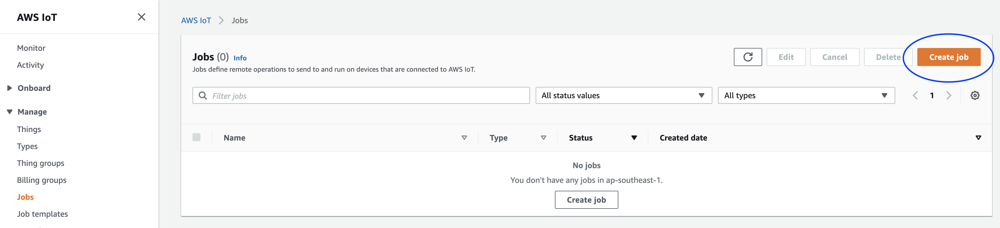
2. Create custom job -> Next.
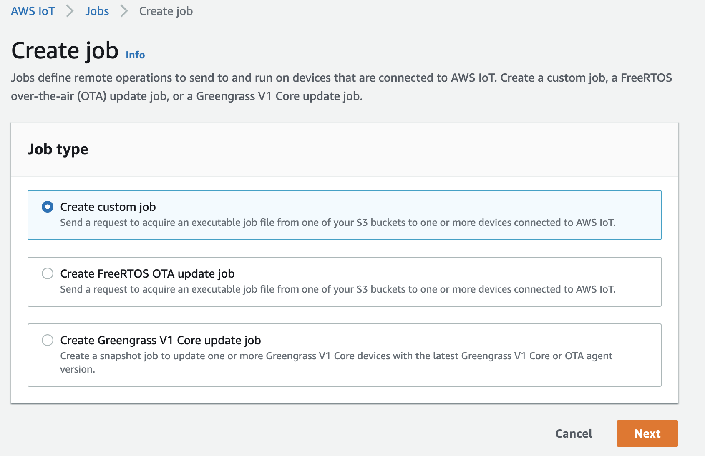
3. Fill **Name** and **Description**, click **Next**.
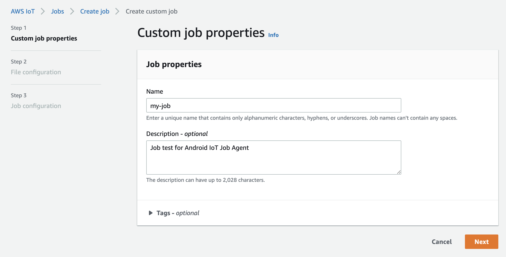
4. Choose the target things or groups, set up the **Job file** uploaded at [Prepare Job Document](#prepare-job-document), set up the **Pre-signing role** created at [Create Pre-signing Role For IoT Job](#create-pre-signing-role-for-iot-job), click **Next**.
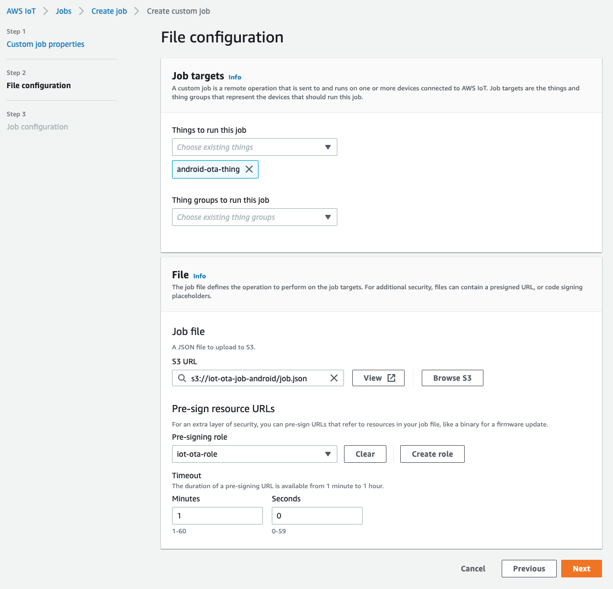
5. Snapshot -> Submit
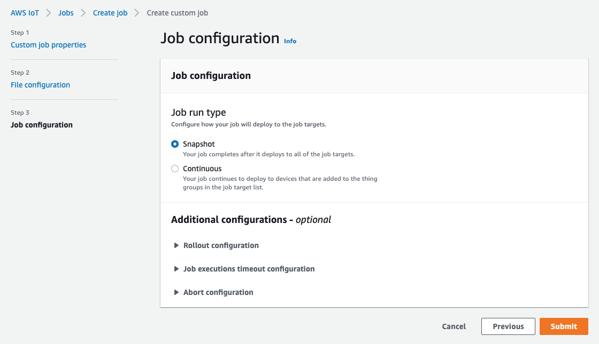

#### Control OTA Job In Demo App
1. Start Demo App:

<p align="center">
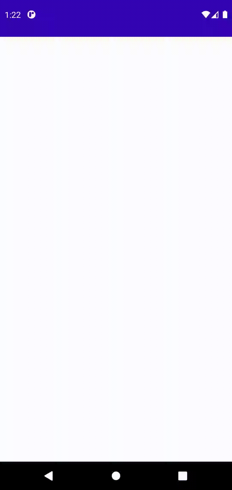
</p>

1. If IoT OTA Agent Service is up and running, demo app will received the job we created at [Create Job From AWS IoT Console](#create-job-from-aws-iot-console):

<p align="center">
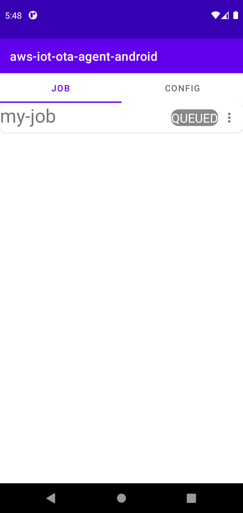
</p>

3. Alternatively, you can swipe down to require IoT OTA Agent Service to fetch pending jobs:

<p align="center">
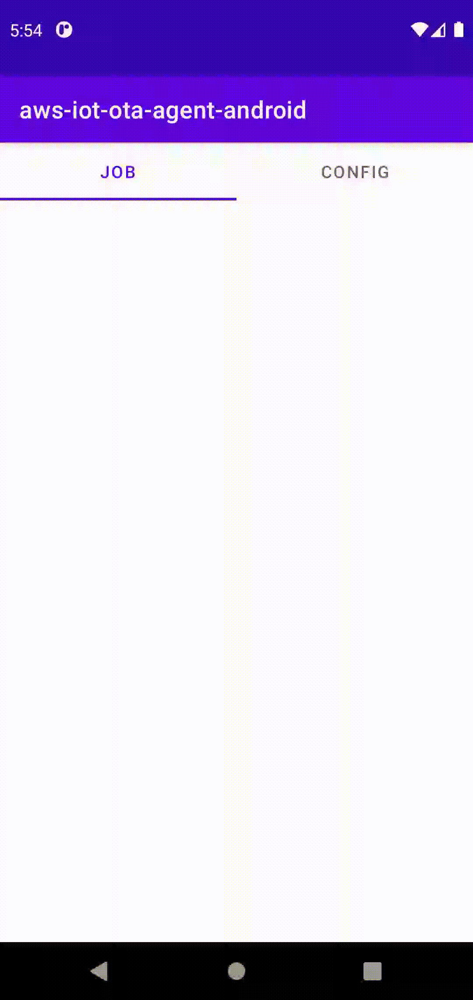
</p>

4. (Optional) You can swipe to **CONFIG** tab to disable/enable MD5 Check or Code Sign Check(SHA256withECDSA).

<p align="center">
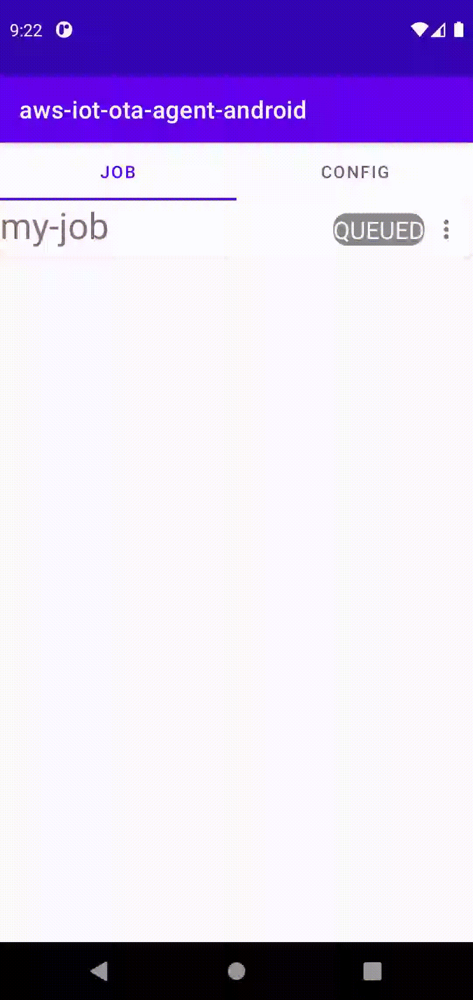
</p>

5. Click **Start** to require IoT OTA Agent Service start downloading. You can reject this job as well.

<p align="center">

</p>

6. Job status will change to **DOWNLOADED** once artifacts downloading is completed and passed MD5SUM/Code Sign check.

<p align="center">
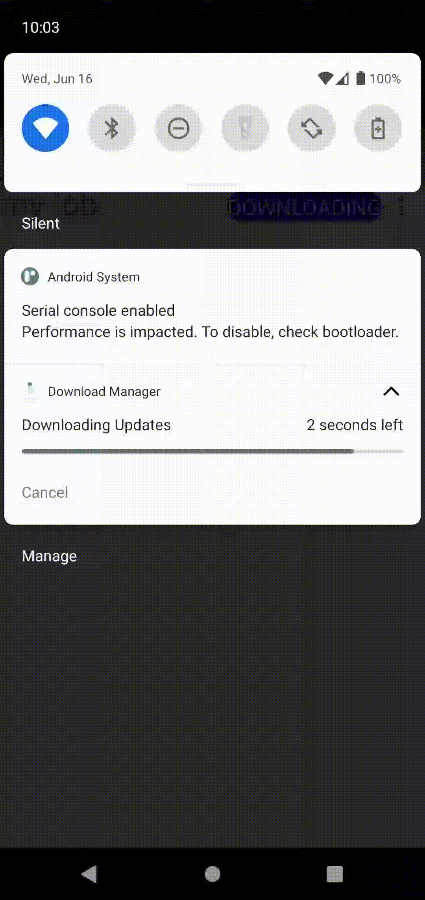
</p>

7. User can notify IoT OTA Agent Service that job status changes to **APPLYING** when applying artifacts(i.e. install, reboot etc).

<p align="center">
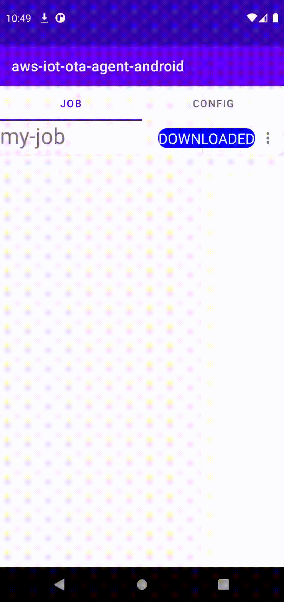
</p>

8. Once artifacts applied successfully, user can notify IoT OTA Agent Service that job has complete. Job status will change to **SUCCEED**.

<p align="center">
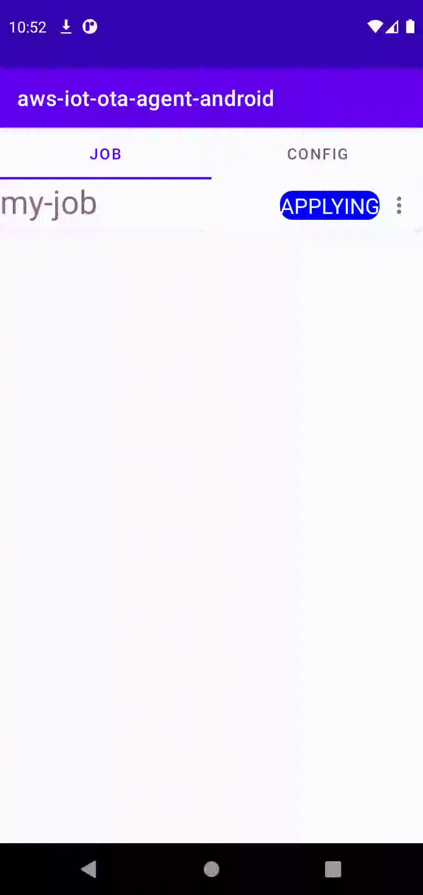
</p>

## Artifacts Download File Path
*/Android/data/com.amazonaws.iotlab/files/Download/*

## Contribution
See [CONTRIBUTING](CONTRIBUTING.md) for more information.

## License
This repository is licensed under the [Apache 2.0 License](https://github.com/aws-samples/aws-iot-job-agent-android/blob/master/LICENSE).
